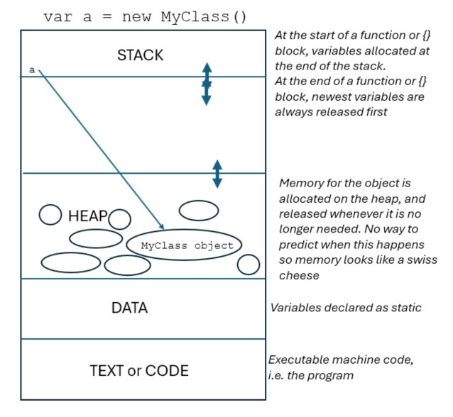

## 4 Feb 2025
# Interfaces

We talked about interfaces this week and discussed how in the early versions of C#, interfaces and abstract classes were quite different things. Originally, interfaces only allowed methods (without bodies) to be defined, and it was up to the implementing class to provide the code for the methods. Properties were not allowed and static properties and methods were not allowed. In contrast, abstract classes allowed all of these features.

In modern versions of C#, interfaces now look much more like abstract classes, because methods with bodies, and properties (both instance and static) are allowed.

Today the key difference between interfaces and classes is that a class may only **inherit** from **one** base class, but can **implement** **many** interfaces. This is an important difference. Interfaces allow us to model an collection of behaviours in a way that breaks it down into multiple very specific features, where each feature is responsible for something distinct and self contained. This is **cohesion**.

In our example, we realised that our shapes all had the capability of calculating its area. So we created the AreaProvider interface which has a method called getArea(), and in Circle and Rectangle we just made them implement the interface. Square inherits from Rectangle so there was no need to declare the interface there.

At the same time, we also added a class that models a 3D object. So to give each class the capability of telling us whether it is a 2D or a 3D object, we introduced the DimensionProvider which has two methods called Is2D() and Is3D(). We implemented this interface on the Circle, Rectangle and the new 3D object class.

Being able to create an interface to model each new capability or feature that our model supports means that we are not restricted by the single inheritance of classes, and simplifies the modelling because we don't need to face the challenge of working out what the base class should be. Typically, there are many candidates for a base class and by choosing one, you can't choose the others. In this case, the hierarchical class structure isn't helping our modelling task, it's forcing us to make an arbitrary choice. In our example, we have moved the getArea() feature out to an interface. This frees us from having to consider whether Shapes are the only types that support getArea(). It's possible that we want 3D objects to also provide the getArea() feature, but 3D objects are not (2D) Shapes. Using interfaces, we don't need to think about this problem.

To use the new interfaces, we added two new functions in our main program, GetDimensionData() and GetShapeData(). The arguments were passed in as DimensionProvider and AreaProvider interfaces, rather than Circle, Rectangle, Square, or Ball. And the code within these functions also only used these interfaces. So this design has low **coupling**. Each method only has dependencies to types that it cares about. It means that in future we can extend our program with new classes, and as long as they implement the interfaces correctly, we don't have to change anything about these functions.

# Summary

Interfaces allow us to add new features and capabilities to a class in a microscopic way because we only need to define and implement the minimal required interface methods. The interfaces aren't restricted by a class hieararchy so it's straightforward to implement them on classes as needed. The calling code only needs a reference the interface, not the actual class that implements it.

Base classes are still useful in most programs. Very often there will be a good candidate for a base class where the "is a" test works for a set of concrete classes. Shape is probably still a good base class because 2D shapes have a lot in common and it makes sense to group a larger number of methods on one class. For interfaces, it's useful to ask whether the class "has this feature or capability or characteristic", or "will I want to call this class in this way". 

# Side Notes

## Casting (implicit)
We talked a bit about casting and I have attached a picture to illustrate a mental model of what is happening when you cast a variable of a class to an interface or a base class. . No actual copying of the object takes place and the whole object is always in memory for as long as the variables are alive. The circles represent the set of fields and methods that can be accessed by the variables according to their type. Implicit casting only happens from Derived to Base, or Derived to interface, and the effect is to reduce the set of fields and methods that can be accessed. This is how coupling is reduced because it exposes our code to fewer things that might break it.

Note that with explicit casting you can cast with fewer restrictions but it comes at the price of error checking whether it was legal or not. For example, if you hold a variable to a Base class, you can try to cast that explicitly to a more Derived class, but it might fail if the whole object isn't the Derived class you were expecting.

## Process memory
We talked a bit about process memory. This is a useful area to understand as it helps our mental model of what is actually happening in the program. 

We talked about variables which are static. Memory for static variables is created once only and lasts for the life of the program. So there is only one **instance** of the variable, and anywhere that accesses the variable will see the same value. This data is stored in the DATA section and it remains in the same location for the whole program, so it's very fast to access.

Memory for variables and ValueTypes is allocated on the Stack. New instances of variables and ValueTypes are created at the start of a function or code {} block and released in reverse order at the end. So the newest allocated space is also the first to be released, so holes never appear in the Stack.

Memory for classes is allocated on the heap. (The variable(s) - there may be $>1$ - that refers to the class object lives on the stack but the class object itself lives on the heap). Because the lifetime of class objects on the heap doesn't follow the "first in first out" rule of stack memory, holes will appear in the heap needs extra CPU time to clean up and manage.

